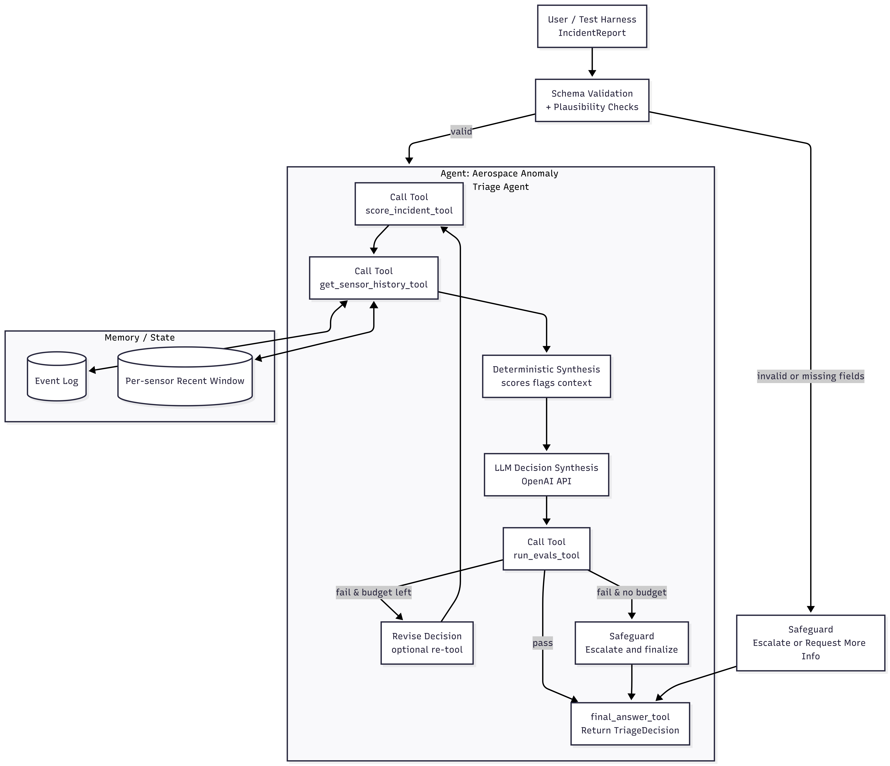

# Agentic AI — Aerospace Anomaly Triage Workflow

## Project Description

This project implements a small-scale agentic AI system that triages simulated aerospace sensor incidents into **Normal**, **Suspicious**, or **Critical** categories and recommends safe next actions. The agent is designed as a **decision-support workflow**, not an autonomous controller. It demonstrates how reasoning, tool use, memory, evaluation, and safeguards can be combined into a transparent and auditable agent architecture.

The system integrates deterministic diagnostic tools, limited contextual memory, LLM-based synthesis, and rule-based evaluation. A bounded revision loop ensures that unsafe or inconsistent outputs are corrected before finalization. The project emphasizes reliability, interpretability, and responsible AI design rather than maximizing autonomy.

This notebook can be interpreted as a prototype triage module for aerospace monitoring pipelines, where AI assists human operators in anomaly assessment under uncertainty.

---

## What I Built

I implemented a complete agentic workflow that includes:

- Structured incident schemas
- Deterministic anomaly scoring tools
- Limited memory for recent sensor history
- LLM decision synthesis with structured outputs
- Rule-based evaluation and revision loop
- Safety safeguards and fallback policies
- Transparent trace logging
- Scenario testing with observable outputs
- A reproducible notebook that runs top-to-bottom

The system demonstrates practical agent orchestration and safety-aware AI design suitable for high-stakes monitoring environments.

---

## Agent Architecture

The Aerospace Anomaly Triage Agent follows a bounded reasoning workflow:

```
Input → Tools → LLM Synthesis → Evaluation → Revise / Finalize
```

Key properties:

- Deterministic scoring grounds decisions in explicit rules
- The LLM interprets evidence but cannot override safeguards
- Evaluation gates enforce safety constraints
- Missing-data and uncertainty safeguards trigger escalation
- A revision budget prevents runaway loops
- Structured traces make decisions inspectable

Architecture diagram:



---

## How to Run `agentic_system.ipynb`

### Install dependencies

```
pip install -r requirements.txt
```

The requirements file was generated using:

```
pip freeze > requirements.txt
```

### Run the notebook

1. Clone or download this repository
2. Open `agentic_system.ipynb` in Jupyter or Google Colab
3. Run all cells from top to bottom

The notebook executes without hidden state and reproduces the full agent workflow.

Optional (Google Colab):

If using Google Drive storage, mount Drive using the environment setup cell at the top.

---

## Reproducibility

This project emphasizes reproducible agent behavior:

- Deterministic scoring logic
- Fixed scenario definitions
- Explicit safeguards
- Structured JSON decision traces
- Captured environment via requirements.txt
- Version-controlled workflow via Git

Another user can recreate the system using only repository contents.

---

## Safety and Responsible Design

This agent prioritizes **safe fallback behavior** over confident guessing:

- Missing data triggers escalation or information requests
- Evaluation rules override unsafe model outputs
- A bounded revision loop prevents uncontrolled reasoning
- Decisions include transparent trace logs

The system is designed for **human-in-the-loop operation**, not autonomous action. It reflects risk-aware AI principles suitable for safety-critical domains.

---

## Observed Behavior and Limitations

Testing demonstrates stable classification across normal, suspicious, critical, and missing-data scenarios. High-risk incidents escalate reliably, and safeguards activate when required fields are absent.

A limitation appears near scoring thresholds: borderline sensor values may be classified as fully normal due to hard cutoffs. This reflects a limitation of the simplified scoring model rather than the agent architecture. Future improvements could include probabilistic scoring and calibrated uncertainty modeling.

---

## Future Extensions

Potential enhancements include:

- Probabilistic anomaly scoring
- Confidence calibration
- Long-term trend memory
- Adaptive thresholds by mission phase
- Adversarial stress testing
- Real sensor dataset integration
- Human feedback loops

These upgrades would increase realism without changing the core orchestration architecture.

---

## Repository Structure

```
📓 agentic_system.ipynb
📄 Agentic_AI_System_Design_Report.pdf
📄 requirements.txt
🖼 mermaid-chart.png
📘 README.md
```

This repository demonstrates a professional agentic AI workflow focused on safety, transparency, and responsible decision-support design.
